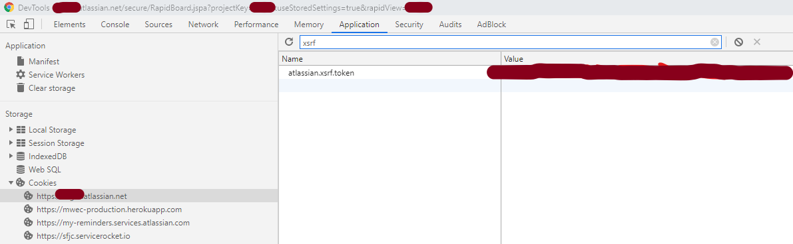

# Greenhopper Sprint Reports

A node utility script to get JIRA sprint information from their `greenhopper` internal API.

`greenhopper` is NOT an official, public API and can therefore break at any time.

Due to the hacky nature of reverse engineering utility from active browser sessions, this script may or may not work for you.

Improvements and additions are welcome.

## Required

`>= Node.js 8.16.0`

## Environment

Environment variables can be made available to the script either by creating a `.env` file at same level as `package.json` OR by setting
actual environment variables.

```bash
CSRF=_csrf_COOKIE_FROM_BROWSER
XSRF=atlassian.xsrf.token_COOKIE_FROM_BROWSER
CLOUD_SESSION=cloud.session.token_COOKIE_FROM_BROWSER
URL=your.atlassian.net
```

### Cookies

Cookie information that you'll have to pull from an active browser session:

`_csrf`

`cloud.session.token`

`atlassian.xsrf.token`

There are a couple of ways to get these cookies, Chrome DevTools is one (F12 when logged into your Atlassian account, `Application` tab, expand
`Cookies` in left-hand pane under `Storage`):




## Build

```bash
npm run build
```

## Run

### Options

```bash
Usage: index.js [options]

Options:
  --version       Show version number                                  [boolean]
  -b, --board     The board ID (rapidViewId) of the board to query
                                                             [number] [required]
  -s, --sprints   Number of sprints to query (most recent)          [default: 5]
  -v, --velocity  Output file for velocity CSV data (incl path)
                                                     [default: "./velocity.csv"]
  -e, --effort    Output file for effort split CSV data (incl path)
                                                       [default: "./effort.csv"]
  --count-all     Disregards WHEN an issue was added to the sprint, counts ALL
                  issues in sprint as committed                        [boolean]
  --debug         Passing the debug option writes ALL issue and sprint report
                  information to debug.json                            [boolean]
  -h, --help      Show help                                            [boolean]

Examples:
  index.js -b 10911 -s 5 -v velocity.csv    writes sprint velocity to file
  -e effort.csv --count-all --debug
```

### Additional Information

```bash
-b, --board
```

The board ID can be obtained from your project's URL:


```bash
-e, --effort    Output file for effort split CSV data (incl path)
                                                       [default: "./effort.csv"]
```

"Effort split" writes the issue types for each sprint, with their corresponding estimates, as csv (`sprint, type, estimate`) to file.

```bash
--count-all
```

The standard way that JIRA calculates sprint commitment, is by excluding the story points of all tickets that were added AFTER the sprint
started from the commitment calculation.

An alternative argument is that ALL points should count towards commitment as the team had agreed to include additional stories after the sprint
start date, i.e. they committed to the extra work. The `--count-all` command line option is for this scenario.

```bash
--debug
```

A complete dump of all the data retrieved from JIRA. Passing this option writes to a `debug.json` file that is generall really large!

### Example

Note: `NODE_ENV` must be set to `production` to read the `.env` file

The following command will retrieve the 10 most recent sprints for board 12345, writing sprint information to `myboard.csv`, counting all
tickets towards commitment regardless of date added to sprint.

```bash
NODE_ENV=production node ./dist/index.js -b 12345 -s 10 -d /c/velocity/myboard.csv --count-all
```
